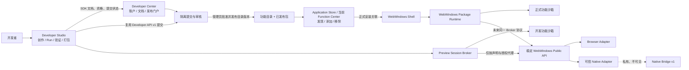
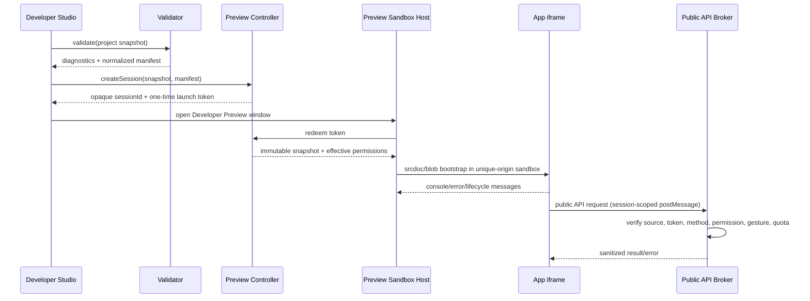

# WebWindows Developer Studio：现状审计与 MVP 架构设计

状态：设计草案 0.1
日期：2026-08-29
范围：现状审计、产品边界、SDK/安全模型、MVP 架构和实施顺序
非目标：本阶段不实现 Studio，不修改 Native Bridge v1，不改变现有公共 API、开发者中心、功能中心或发布链路

## 结论摘要

WebWindows 已经具备 Developer Studio MVP 的主要外围基础：全局功能目录、按用户保存的安装关联、功能中心、开发者资格/API Key、ZIP 提交、隔离审核、管理员批准/发布、已发布包下载，以及 `browser-zip-sandbox-v1`。因此可以开始 Studio 的“本地项目、编辑、静态验证、纯 Web 预览、打包和复用现有提交接口”部分。

目前还不具备直接开放“带 WebWindows API 的第三方功能调试”的完整条件。阻塞点不是编辑器，而是生态契约尚未正式收敛：仓库中没有机器可读的 Manifest JSON Schema，没有第三方权限声明/授权模型，没有功能生命周期规范，没有 SDK 类型包，也没有从第三方沙箱到稳定公共 API 的受控代理。当前 ZIP 沙箱故意是唯一来源、无网络的 `srcdoc` iframe，并未向包内代码注入 `window.WebWindows`。

推荐先冻结最小 SDK 契约和 Preview Broker，再实现 Studio。开发运行应采用“临时预览会话”，不写功能目录、不写安装关联、不上传审核区；不推荐把 Run 实现为正式或临时安装。未来若需要“开发安装”，也应使用独立命名空间、独立存储、显著标识和自动过期机制。

## A. 当前生态现状审计

### A.1 真实组成与代码入口

当前生产实现的关键组成如下。

| 领域 | 当前真实入口 | 作用 |
| --- | --- | --- |
| Shell | `index.html` | 加载窗口管理、功能注册表、桌面/开始菜单等；功能通过 Shell 窗口打开 |
| 功能目录 | `api/function-catalog.asp` | 返回当前发布目录；首次可由 `data/apps/system-apps.json` 播种 |
| 客户端注册表 | `assets/js/app-registry.js` | 校验目录最小字段、合并核心容灾项、查询安装状态、启动功能、解析文件关联 |
| 功能中心 | `function-center.html` + `assets/js/function-center.js` | 浏览、搜索、添加、打开、移除功能；目前是事实上的应用商店前台 |
| 安装同步 | `assets/js/function-sync.js` + `api/function-associations.asp` | 登录用户的安装关联在浏览器与服务器之间同步 |
| 第三方包运行 | `package-runtime.html` + `assets/js/package-runtime.js` | 下载已发布 ZIP、客户端解压/校验/重写资源、在沙箱 iframe 中执行 |
| 开发者中心 | `developer.html` + `assets/js/developer-center.js` | 文档、样例、开发者资格、Key、从私人云资料选择 ZIP、提交 |
| 开发者 API | `developer_api/v1.asp` | 资格、Key、Manifest 登记、原始 ZIP 上传、提交状态查询 |
| 审核后台 | `SystemManager/developer-platform.html` + `admin_api/developerPlatform.asp` | 开发者审批、查看 Manifest、下载隔离包、批准/驳回/发布/撤销 |
| 功能目录后台 | `SystemManager/functions.html` + `admin_api/functionCatalog.asp` | 编辑、上下架并发布全局目录版本 |
| 公共设备 API | `assets/js/device-api.js` | 稳定公共边界 `window.WebWindows.device`；内部可选择 Browser/Native adapter |
| 私有 Native ABI | `docs/NATIVE_BRIDGE_V1.md` 对应实现 | 仅供可信 Runtime 与公共 Device API 内部使用；不是第三方 SDK |

仓库根目录下的 `WebWindows/` 是一个 gitlink/submodule 工作树，且当前已有用户修改。本审计以父仓库当前生产文件为事实来源，没有修改或纳入该子仓库。`F:\Win11Documents\WebWindows` 当前主要包含备份和工作目录，不作为生产规范来源。

### A.2 功能的两种真实形态

当前“功能”不是统一的物理项目形态，而是至少两类：

1. 内置/预装功能：程序文件直接位于站点目录中，定义集中存放在功能目录 JSON。它们未必拥有独立项目目录或自己的 `manifest.json`；入口可以是普通 HTML/ASP，也可以通过 `launch.adapter` 进入 Shell 适配器。
2. 第三方 ZIP 功能：ZIP 根目录约定包含 `manifest.json`、HTML 入口、图标和本地依赖。审核发布时，提交的 Manifest 被增强为目录项，并把原始 `entry` 改写为 `package-runtime.html?...`。

因此，“当前 WebWindows 功能的真实项目结构”不能简单描述为每个功能一个目录。Developer Studio 应把第三方 ZIP 项目定义为正式、可创作的项目模型，但不能反向假设所有历史内置功能已经符合该模型。

当前官方最小样例结构是：

```text
hello-webwindows/
├─ manifest.json
├─ index.html
└─ icon.svg
```

### A.3 当前 Manifest/目录元数据

当前目录与样例中实际使用的主要字段包括：

- 身份：`id`、`legacyIds`、`type`、`name`、`description`、`category`、`version`；
- 文件：`icon`、`entry`；
- 安装：`install.defaultState`、`install.source`、`install.uninstallable`；
- 摆放：`placement.desktop/startMenu/startMenuGroup/startMenuOrder/allFunctions/taskbar`；
- 窗口：`window.mode/singleton/width/height/className`；
- 启动适配：`launch.adapter`，目前用于少数系统功能；
- 文件处理：`fileHandlers[].action/adapter/extensions/mimeTypes/priority`；
- 商店状态：`catalog.status`；
- 发布后包信息：`package.format/size/sha256/entry/downloadUrl`；
- 发布后运行信息：`runtime.model/network/sameOrigin`。

当前仅存在实现中的“最小字段校验”和文档示例，不存在仓库内可供编辑器、客户端、服务端和审核端共同消费的正式 JSON Schema。服务端提交阶段对 Manifest 的检查主要是长度、外层 `{}` 和文本中是否包含匹配的 `id`；它不是完整 JSON Schema 校验。后台发布阶段只额外检查包内入口路径格式，包结构/文件类型/CRC/解压大小等主要在最终客户端运行时检查。

结论：Manifest v1 已有事实格式，但尚未成为单一、机器可读、端到端一致执行的正式规范。

### A.4 安装与卸载的真实语义

当前安装不是复制包文件，而是建立“主体—功能”关联：

```text
全局已发布目录 + 用户安装关联 -> 用户可见/可启动功能集合
```

- 匿名用户使用本地 `IndexedDB`，失败时回退 `localStorage`；
- 登录用户的关联以 `user:<id>`/用户名作用域保存，并由同步模块写入 `api/function-associations.asp`；
- 系统功能或 `uninstallable:false` 始终视为已安装；
- 普通功能没有显式关联时使用 `install.defaultState`；
- `install()` 写入 `state:installed`、来源、桌面可见性和时间；
- `uninstall()` 写入 `state:uninstalled`、隐藏桌面图标，并默认 `retainData:true`；
- 卸载不会删除服务器程序、已发布 ZIP 或云资料。

这套模型适合 Store/Function Center，也说明 Developer Studio 的 Run 不应借用 `install()`：否则预览会污染用户关联、同步状态、桌面/开始菜单和文件处理器。

### A.5 启动与运行生命周期

当前 `WebWindows.apps.launch(appId)` 的真实流程是：

1. 从已发布目录找到功能；
2. 检查当前主体是否已安装；
3. 对 Shell 特例调用固定 `launch.adapter`；
4. 普通功能调用捕获的 `openWindow(...)`；
5. `window.mode === "iframe"` 时在 Shell 窗口中以 iframe 打开目录中的 `entry`。

第三方已发布包的目录 `entry` 指向 `package-runtime.html`。包运行页再执行：

1. 根据 `appId/version` 从 `api/function-package.asp` 下载仅限 `status='published'` 的 ZIP；
2. 使用 JSZip 校验 CRC 并解压；
3. 限制最多 500 个文件、30 MB 解压大小、允许的扩展名，并拒绝符号链接和不安全路径；
4. 拒绝 ES Module，把本地经典脚本/样式内联，把媒体和字体改写为 data URL；
5. 注入 `connect-src 'none'` 等 CSP；
6. 使用 `sandbox="allow-scripts allow-forms allow-modals allow-downloads"` 且无 `allow-same-origin` 的 `srcdoc` iframe 运行。

当前没有正式的功能生命周期协议。可观察到的只有启动、窗口/iframe 页面加载、浏览器 `visibilitychange/pagehide` 等自然事件；不存在规范化的 `onLaunch/onActivate/onSuspend/onClose`、状态保存或关闭协商。`singleton` 是窗口管理行为，不是应用生命周期契约。

### A.6 第三方包与公共 API 的当前关系

`window.WebWindows.device` 是已经文档化且实现了 Browser/Native adapter 的公共边界；`window.WebWindowsNative` 是被冻结的私有 Native ABI，普通功能不得直接调用。

但是当前第三方 ZIP 的内层 iframe：

- 没有 `allow-same-origin`，因此是唯一来源；
- 包内代码被组装进 `srcdoc`；
- 没有 SDK bootstrap；
- 没有从内层沙箱到外层 Runtime 的能力代理；
- CSP 禁止网络连接。

所以现状是“公共 API 对同源内置页面可用”，不是“第三方 ZIP 已可使用公共 API”。Developer Studio 不能通过把 `parent.WebWindows`、`window.WebWindowsNative` 或宿主对象直接塞进 iframe 来绕过这一缺口。

### A.7 应用商店现状

当前生产目录中没有独立的 `Application Store` 页面或 Store 领域后端。`功能中心` 已经承担目录浏览、搜索、分类、添加、打开和移除，因此它是事实上的 Store 客户端。旧的实验/历史目录中出现过 `store.html` 引用，但当前根生产入口没有对应正式 Store 实现。

推荐保留一个目录、一个安装模型、一个发布链路：短期把 Function Center 视为 Application Store 的当前产品形态；未来可更名或增加商店展示层，但不要新建第二套目录、安装记录或包仓库。

### A.8 提交与发布链路

当前真实链路为：

```text
开发者登录
  -> 申请资格 pending
  -> 管理员批准 approved
  -> 生成一次性显示的 API Key（服务端仅存 SHA-256）
  -> 从私人云资料选择 ZIP
  -> 浏览器计算 ZIP SHA-256
  -> submit 登记 appId/version/Manifest/hash
  -> upload-package 上传原始 ZIP
  -> 服务端检查大小、ZIP 文件头、重新计算 SHA-256，存入隔离表
  -> 管理员查看 Manifest/下载隔离包
  -> approved 或 rejected
  -> approved 后发布：增强 Manifest、改写 entry、写入新目录版本
  -> submission 状态 published
  -> Function Center 刷新目录
  -> 用户添加关联并运行
```

已存在的安全/治理措施包括：开发者资格、API Key 哈希、Key 撤销、每小时 30 次提交限制、app ID 所有权、包大小限制、SHA-256 双算、隔离包只有管理员可下载、状态机和只有 published 包可由公共端点下载。

仍需补齐：服务端完整 ZIP/路径/解压/入口/Manifest Schema 检查、自动扫描报告、签名或发布证明、审核策略版本、权限审查、SDK/runtime 兼容检查、撤销与目录下架的一致事务。目前“撤销 submission”不会自动下架目录项。

## B. Developer Studio 产品定位

Developer Studio 是 WebWindows 官方功能 IDE，关系类似 Xcode 对 Apple 平台，而不是浏览器里的通用 VS Code。

它负责：

- 创建符合 WebWindows 规范的功能项目；
- 编辑包内 HTML/CSS/JS、Manifest 和资源；
- 提供 WebWindows SDK 类型、文档和 Design Tokens；
- 在与生产 Runtime 同构的沙箱中 Run/Reload；
- 显示应用 Console、生命周期、权限和 capability 诊断；
- 在本地执行确定性的项目验证和打包；
- 调用现有 Developer Center/Developer API 完成提交。

它不负责：

- 通用多语言工程、任意二进制构建或系统开发；
- Node.js/Docker/Remote SSH/完整 npm/任意终端；
- 管理员审核、上架和下架；
- 用户发现、购买或安装正式功能；
- 暴露 Native Bridge、系统私有对象或 Shell DOM；
- 绕过开发者资格、审核、目录发布和正式安装关联。

第一阶段支持“纯静态、包内依赖、经典 JS”的 WebWindows 功能。npm 可以作为仓库构建 Studio 自身的开发工具，但不能成为 Studio 内向功能开发者暴露的运行能力。

## C. Developer Studio 与 Developer Center / Store / Runtime 的关系图



职责边界：

| 系统 | 保留职责 | 不应承担 |
| --- | --- | --- |
| Developer Studio | 项目、编辑、Run、Console、本地验证、打包、发起提交 | 开发者审批、人工审核、商店发布、正式安装 |
| Developer Center | 官方规范/教程/样例、开发者账户与资格、Key/凭证、提交历史/状态、发布政策 | 完整代码编辑器、本地项目工作区、运行时调试 |
| Application Store / Function Center | 已发布目录展示、搜索、正式添加/移除/启动、用户评价等未来能力 | 开发预览、未审核包运行、开发者凭证管理 |
| Runtime/API | 沙箱执行、能力代理、权限执行、生命周期信号、兼容性事实 | 项目管理、审核决策、商店展示 |
| SystemManager | 开发者审批、自动/人工报告、批准/驳回、目录发布/撤销 | 面向普通开发者的创作体验 |

Developer Center 现有的文档、Manifest 参考、样例、资格、Key、提交和状态查询应保留。Studio 可以深链到这些能力并复用认证/接口，不复制资格系统或审核数据库。Developer Center 当前内嵌的原始 Manifest 文本框和 ZIP 提交表单可长期作为低依赖/故障回退入口。

## D. MVP 功能清单及优先级

### P0：可称为 MVP 的闭环

| 模块 | MVP 行为 | 验收标准 |
| --- | --- | --- |
| 新建功能 | 从官方最小模板创建，生成唯一建议 ID、Manifest、HTML、图标占位 | 新项目首次 Run 即可显示 |
| 项目工作区 | 每项目独立虚拟文件系统、文件树、新建/重命名/删除、导入/导出 ZIP | 路径规范与包运行时一致；项目之间不可互读 |
| 编辑器 | HTML/CSS/JS/JSON 语法、搜索、格式化基础、错误标记、未保存状态 | 不提供任意终端或包安装 |
| Manifest 可视化编辑 | 表单与 JSON 双向同步；字段帮助；危险/保留值不可选 | 用正式 Schema 校验，不再复制手写规则 |
| Run/Reload | 创建内存预览会话并在 WebWindows 沙箱窗口运行；不写目录/安装关联 | 关闭 Studio 后会话失效；UI 明示“开发预览” |
| Console | 捕获预览 iframe 的 `console`、未捕获异常、Promise rejection、Runtime/权限诊断 | 消息带项目/会话来源和时间；不能读其他窗口日志 |
| 静态验证 | Schema、路径、入口、文件数、大小、扩展名、外部 URL/ES Module、保留 API 扫描 | 规则与发布 Runtime 对齐并有规则 ID |
| 打包 | 确定性 ZIP，Manifest 位于根目录，计算 SHA-256，生成验证报告 | 同一输入产生相同文件顺序和内容摘要 |
| 提交 | 使用现有登录/开发者资格与 Developer API v1；提交前强制 P0 验证 | 未批准资格时跳转 Developer Center；不保存明文 Key |
| SDK 基线 | Manifest Schema、公共 API `.d.ts`、Runtime/capability 版本表、最小生命周期文档 | Studio、CI smoke 和文档消费同一份版本化资产 |

### P1：MVP 后紧接的专业体验

- WebWindows API 自动补全、签名帮助、跳转官方文档；
- 权限声明建议、声明未使用/使用未声明检查；
- capability 模拟矩阵，例如 browser/android、支持/不支持 storage；
- Manifest diff、升级提示与兼容性解释；
- 预览尺寸、触控/键盘、浅色/深色和语言切换；
- 项目快照、自动恢复、从 ZIP 打开现有项目；
- 提交历史、审核反馈和重新提交体验；
- 验证报告随提交保存，供后台审核显示。

### P2：明确延后

- 独立调试器断点/源码映射高级体验；
- 团队协作、云端项目同步、版本控制 UI；
- 开发安装、跨设备测试通道；
- 受控网络权限；
- npm 依赖解析、Node 运行、终端、Remote SSH、Docker；
- 插件市场或任意语言扩展。

### Monaco Editor 可行性

Monaco 可行，适合 JSON Schema、HTML/CSS/JS language service、`.d.ts` 自动补全和诊断，也是推荐 MVP 方案，但应满足以下约束：

- 作为 WebWindows 仓库构建时依赖预编译，运行时不提供 npm；
- 静态资源与 worker 全部本地部署，不从 CDN 动态加载；
- 独立 Studio bundle，避免把 Monaco 体积加入 Shell 首屏；
- 明确 worker URL/CSP，按语言懒加载；
- 禁用/不实现终端、扩展主机、任意文件系统和 VS Code 协议能力；
- 只向 JS language service 注册稳定公共 API `.d.ts`，不注册 Native 私有类型。

如果首批包体/worker 集成时间不可接受，CodeMirror 6 可作为短期编辑器，但会弱化类型提示和 Manifest/SDK 诊断。基于本产品定位，推荐直接使用受限 Monaco，而不是先造一套临时编辑器。

## E. 建议架构

### E.1 逻辑模块

```text
Developer Studio Shell
├─ Project Service
│  ├─ Project Repository（IndexedDB，项目级作用域）
│  ├─ Virtual File System
│  ├─ Import / Export
│  └─ Template Service
├─ Editor Workbench
│  ├─ File Tree
│  ├─ Monaco Host
│  ├─ Manifest Form
│  └─ SDK Language Service
├─ Validation Service
│  ├─ Manifest Schema Validator
│  ├─ Package/Path Rules
│  ├─ Permission/API Usage Analyzer
│  └─ Runtime Compatibility Analyzer
├─ Build Service
│  ├─ Deterministic ZIP
│  ├─ SHA-256
│  └─ Validation Report
├─ Preview Controller
│  ├─ Session Registry（仅内存）
│  ├─ Preview Asset Resolver
│  ├─ Sandbox Host
│  ├─ Console Transport
│  └─ Capability Broker
└─ Submission Adapter
   ├─ Developer Profile/资格检查
   ├─ Developer API v1 Adapter
   └─ Developer Center Deep Link
```

### E.2 推荐项目目录

第三方项目的建议目标结构：

```text
my-webwindows-function/
├─ manifest.json
├─ index.html
├─ styles/
│  └─ app.css
├─ scripts/
│  └─ app.js
├─ assets/
│  └─ icon.svg
└─ README.md                 # 可选，不参与运行
```

MVP 仍需兼容当前样例的根目录 `icon.svg`。不要强迫现有 v1 包迁移目录，只让新建模板采用一致结构。

### E.3 数据存储

- 项目元数据和文件内容：独立 IndexedDB，例如 `webwindows-developer-studio-v1`；
- 每个项目以不可猜测 UUID 分区，不使用功能 ID 作为唯一存储隔离键；
- 编辑器缓存与最近文件：项目分区内保存；
- Preview session、token、授权和 Console：仅内存保存，不进入安装数据库、不进入目录缓存、不参与 function sync；
- 打包结果：用户显式导出到私人云资料或浏览器下载；
- API Key：不写项目、不写 localStorage、不打包；优先改为现有登录会话可换取短期提交令牌。若 MVP 必须复用明文 v1 Key，只在当前提交表单内存中使用并明确提示。

### E.4 Run/Preview 数据流



推荐的立即运行机制是“预览会话”，原因如下：

- 不写 `WebWindows.apps` 目录；
- 不调用 `install()`/`uninstall()`；
- 不生成服务器 submission；
- 不注册桌面、开始菜单、任务栏或文件处理器；
- 项目修改只生成新的不可变 snapshot；Reload 原子替换会话版本；
- 预览窗口带固定开发标识、项目名和权限状态；
- 会话 token 与 iframe `WindowProxy`、项目 UUID、Studio 实例绑定，关闭/超时即撤销。

不推荐的方案：

- 直接 `srcdoc` 但复用父窗口对象：会突破 Shell 与项目隔离；
- 把草稿加入正式目录：会绕过审核并污染所有用户；
- 写一条 `source:development` 的普通安装关联：会被现有同步模块上传；
- 用 `window.open(blob:)` 直接跑：Console、权限和生命周期难以可靠约束；
- 让 Developer Studio 本身解释/调用 `WebWindowsNative`：违反公共边界并把私有 ABI 变成事实 SDK。

### E.5 Preview 与生产 Runtime 同构

Preview Host 和 `package-runtime` 最终应共用同一套纯函数/策略：路径归一化、允许文件类型、资源重写、CSP、SDK bootstrap、权限代理协议、Console 包装和生命周期消息。差异只在资产来源：

- Preview：来自 Studio 的不可变项目 snapshot；
- Production：来自已发布且哈希匹配的 ZIP。

第一阶段不要直接大改现有 `package-runtime.js`。先用测试固定当前行为，再提取无副作用的共享 Runtime Core；旧入口继续调用相同逻辑，以防改变公开运行行为。

### E.6 WebWindows SDK

需要建立正式 SDK，而且应先于 API-enabled Preview。建议最小 SDK 由以下版本化资产构成：

1. `manifest.schema.json`：字段、枚举、默认值、保留 ID、路径、窗口和包限制；
2. `webwindows.d.ts`：只描述稳定的 `window.WebWindows` 公共 API；
3. `runtime-compatibility.json`：Runtime model/API/capability 支持矩阵；
4. `permissions.json`：权限 ID、风险级别、是否需要用户手势、可用 Runtime；
5. `lifecycle.md`/类型：启动、激活、可见性、关闭和销毁的可观察语义；
6. `design-tokens.css`：颜色、字体、间距、圆角、阴影、焦点环和主题变量；
7. 可选轻量 `webwindows-sdk.js`：只实现沙箱内公共 facade、消息协议和事件，不包含 Native 代码。

兼容策略建议：

- 把当前事实格式记录为 Manifest v1，并保持现有包可运行；
- 权限、SDK 版本和明确 Runtime 约束若无法无歧义加入 v1，则定义 Manifest v2，而不是静默改变 v1 含义；
- Developer Studio 新项目默认使用最新稳定 schema，仍可只读/迁移旧 v1；
- `window.WebWindows.device` 的现有行为保持不变；SDK 只描述它，不重新实现它；
- Native Bridge v1 保持冻结且不出现在 SDK、自动补全、文档示例或沙箱错误中。

建议的未来声明示例仅用于说明方向，尚不是当前可发布格式：

```json
{
  "manifestVersion": 2,
  "id": "com.example.hello",
  "version": "1.0.0",
  "entry": "index.html",
  "sdk": { "apiVersion": "1" },
  "runtime": {
    "model": "browser-zip-sandbox-v1",
    "minVersion": "1.0.0"
  },
  "permissions": ["device.network.read"]
}
```

### E.7 生命周期建议

生命周期应是 SDK 层事件，不是 Native Bridge 事件。MVP 可定义：

- `launch`：首次 bootstrap 完成，携带经清洗的 launch context；
- `activate`：已有 singleton 窗口再次被请求打开；
- `visibilitychange`：窗口显示/隐藏或页面可见性变化；
- `beforeclose`：可请求极短时间保存状态，但不能无限阻止关闭；
- `dispose`：Runtime 即将撤销 session，尽力通知，不保证在崩溃/强制终止时到达。

规范必须明确“关键数据不得依赖关闭事件才保存”。Preview 和 Production 应发出同形消息。

## F. 安全模型

### F.1 信任域

| 信任域 | 信任级别 | 可访问内容 |
| --- | --- | --- |
| WebWindows Shell | 高 | Shell DOM、窗口管理、稳定公共 API、内部适配器 |
| Developer Studio | 系统功能 | 自己的项目存储、Preview Controller、提交适配器；不能获得 Native 私有 ABI |
| Preview/Package Host | 受信系统页 | 指定 snapshot/package、能力策略、消息代理；不向内层暴露 DOM 对象 |
| 开发/第三方功能 iframe | 不可信 | 自身虚拟文件、SDK facade、已批准能力结果 |
| Developer Center | 受信业务页 | 账户/资格/提交，不执行未审核项目 |
| 审核隔离区 | 不可信数据区 | 原始 ZIP/Manifest，只有管理员下载/扫描流程可访问 |

### F.2 必须执行的隔离规则

1. 开发功能始终在无 `allow-same-origin` 的 sandbox iframe 内执行，不能读取 Shell/Studio DOM、cookie、storage、IndexedDB、Service Worker 或同源接口。
2. 不把 `window.WebWindowsNative`、Native adapter、Shell `window`、函数引用、DOM 节点或可变宿主对象传入沙箱。
3. SDK 调用只通过结构化 `postMessage` 请求；Broker 校验 `event.source`、session、nonce、方法白名单、参数 schema、权限、用户手势、频率和响应大小。
4. 每个项目与每次 Run 都有独立 UUID/session/token；一个项目的 iframe 不能复用另一个项目的 token、Console 或授权。
5. Preview 不可访问 `api/function-associations.asp`、目录发布接口、管理员接口和 Developer API Key；网络默认 `none`。
6. Preview 不产生正式 app ID 所有权、不占用版本号、不出现在 Function Center、不注册 file handler。
7. 打包和提交必须重新从持久项目 snapshot 生成，不能直接提交已经运行后被 iframe 修改的内存 DOM。
8. 权限默认拒绝；未声明、Runtime 不支持、用户拒绝和缺少手势分别返回稳定、可诊断的公共错误。
9. 生产发布仍必须经过现有资格、提交、隔离、审核和目录发布；Developer Studio 只能调用这条链路，不能写目录。
10. Studio 自身若发生 XSS，影响很大；需本地依赖、严格 CSP、Trusted Types 评估、无任意 HTML 预览注入到 Studio DOM、日志文本化和项目名/Manifest 全量转义。

### F.3 权限模型建议

权限应描述“应用能做什么”，capability 描述“当前 Runtime 能否做”，二者不可混用。

```text
允许调用 = Manifest 已声明
        AND Store/审核允许
        AND 当前用户已授权（需要时）
        AND 当前 Runtime capability 支持
        AND 调用满足手势/参数/配额规则
```

建议从细粒度、低风险能力开始，例如 `device.network.read`、`device.battery.read`、`device.display.read`。写操作、目录选择、文件读取等分别声明并强制用户手势。不要提供一个笼统的 `native`、`system` 或 `device.*` 超级权限。

当前 `window.WebWindows.device.storage` 的授权是宿主页面/来源级；第三方沙箱未来必须在 Broker 层再建立应用/用户级授权，不能把宿主已有的 opaque volume 列表整体透传给所有应用。

### F.4 当前实现需要优先修正的风险（不在本阶段修改）

- 上传端只验证 ZIP 文件头/大小/哈希，完整包安全校验发生得太晚；应在进入可批准状态前进行服务端或受信扫描 worker 验证。
- Manifest 未由统一 JSON Schema 校验；客户端、提交 API、后台和 Runtime 规则可能漂移。
- Runtime 的 JSZip 来自 CDN，增加可用性与供应链依赖；应固定版本、本地托管并纳入构建完整性。
- 发布目录写入与 submission 状态更新不是一个事务；失败可能产生目录已发布但状态未更新，或反之。
- `revoked` 不自动从目录下架，需要管理流程双操作。
- 当前 package rewrite/CSP 是运行时字符串改写，应补充对 HTML base、嵌套文档、URL 变体、超大文本和编码的安全测试。
- Console 桥接若实现不当会成为跨项目数据泄露通道；只允许 JSON 可序列化、大小受限、深度受限的数据副本。

## G. 与现有代码的复用点和需要重构的地方

### G.1 直接复用

- `developer_api/v1.asp` 的资格、Key、提交、包上传和状态查询；
- Developer Center 的账户/资格/样例/提交回退体验；
- 管理后台的人工审批、包下载和发布入口；
- `app-registry.js` 的正式目录、安装关联和启动语义，但 Preview 不调用它；
- `function-associations.asp` 和 function sync 作为正式安装唯一记录；
- `package-runtime.js` 已有的路径、数量、大小、扩展名、CRC、资源重写和 CSP规则；
- `window.WebWindows.device` 作为唯一设备公共 API；
- `cloud-file-dialog.js` 用于显式导入、导出和提交包；
- 官方 `hello-webwindows` 样例作为第一个模板；
- 现有 smoke test 风格，为 Schema、Runtime Core、Preview Broker、打包和提交适配器增加覆盖。

### G.2 先规范化再复用

1. 从开发者页面示例、后台表单和注册表隐式规则中提取正式 Manifest Schema；
2. 从 `package-runtime.js` 提取共享且可测试的 package policy/transform core；
3. 为公共 API 生成/维护唯一 `.d.ts`，并明确稳定/内部表面；
4. 把 Runtime model/capability 兼容事实移入版本化数据，而不是散落在文案和管理员发布代码；
5. 将权限策略和 API 方法映射集中到 Broker policy，避免 Studio 与 Production 各写一套；
6. 将发布动作改造成服务端原子编排或至少带补偿/幂等检查的流程；
7. 长期让 Developer Center、Studio、后台都渲染同一份规范数据，而不是复制 Manifest 示例。

### G.3 不应复用

- 不复用 `openWindow` 的父窗口函数引用作为第三方 API；
- 不复用 Native Bridge 传输对象或方法名；
- 不复用普通安装关联保存预览状态；
- 不把 SystemManager 的目录编辑表单变成 Studio Manifest 编辑器；它面向管理员和已发布目录，职责不同；
- 不把 `software.html` 或历史 `store.html` 当作现有 Developer Studio/Application Store 实现。

## H. 分阶段实施计划

### Phase 0：契约冻结与安全基线（建议先做）

- 发布 Manifest v1 事实规范和 JSON Schema；
- 建立 SDK `.d.ts`，确保无 `WebWindowsNative`；
- 定义 Runtime compatibility/capability 数据格式；
- 定义权限词汇、默认拒绝和 Broker 协议；
- 定义最小生命周期；
- 固定当前 package runtime 行为测试，并设计共享 Runtime Core 的无行为变化提取；
- 为提交包增加与客户端同级的受信预检方案；
- 形成威胁模型与安全测试矩阵。

退出条件：同一个样例在 Schema、Studio validator、审核 validator 和 Runtime policy 下结论一致。

### Phase 1：Studio Alpha（纯 Web 功能）

- 注册 Developer Studio 系统功能；
- 项目仓库、文件树、模板、Monaco、Manifest 表单；
- 本地静态验证；
- 不带特权 API 的 Preview session、Reload 和 Console；
- 确定性 ZIP、SHA-256、导出到私人云资料；
- 复用 Developer API v1 提交；
- 不提供开发安装、网络、终端、npm。

退出条件：新建 Hello -> 编辑 -> Run -> Console -> 验证 -> 打包 -> 提交审核全链路可用，且目录/安装关联零变化。

### Phase 2：SDK 与 API 调试 Beta

- 沙箱 SDK bootstrap 和 Capability Broker；
- 公共 API 自动补全/类型提示；
- 权限声明、授权 UI、调用日志和 capability 模拟；
- Preview/Production 共用 Broker 协议；
- 首批只读低风险 API；存储等高风险能力单独评审；
- 后台显示机器验证、权限和兼容报告。

退出条件：第三方功能只能通过声明过的公共 API 工作；任何路径都无法发现或调用 Native 私有对象。

### Phase 3：发布质量与商店闭环

- 提交短期令牌或会话授权，减少长期 API Key 手工输入；
- 服务端完整包验证、扫描报告、幂等/原子发布和一致下架；
- Developer Center 与 Studio 共享提交历史、审核反馈和迁移提示；
- Function Center 增强为正式 Application Store 产品层，但继续复用同一目录和安装关联；
- Runtime/SDK 兼容告警和分阶段废弃策略。

### Phase 4：受控扩展（按需求）

- 云端项目同步、团队、版本快照；
- 明确隔离的开发安装和跨设备测试；
- 经安全评审的网络/API 类能力；
- 更高级调试与性能工具。

## I. 当前是否具备开始开发 MVP 的条件

结论是“有条件具备”。

可以立即开始：Studio 外壳、项目存储、模板、文件树、Monaco、Manifest v1 Schema 固化、静态验证、纯 Web Preview、Console、确定性 ZIP、SHA-256、复用现有提交接口。

不能直接开始并宣称完成：第三方功能使用 `window.WebWindows.device` 等公共 API 的 Preview/Production 调试。必须先完成 Phase 0 的 SDK、权限模型、Broker 和生命周期最小契约。

建议的 MVP Go/No-Go 条件：

- Go：接受 Alpha 首先支持无特权、无网络、经典 JS 功能；
- Go：先把 Manifest/Runtime 规则做成共享规范；
- No-Go：要求第一版直接把父窗口 `WebWindows` 或 `WebWindowsNative` 注入预览；
- No-Go：要求 Run 通过写正式目录或普通安装关联实现；
- No-Go：在没有服务端完整包校验时把 Studio 本地“通过”视为自动审核通过。

## J. 开始实现时第一批建议修改/新增的文件

以下是建议顺序，不代表本设计阶段已经修改这些生产文件。

### 第一批：只新增规范、测试和隔离 Studio 骨架

```text
docs/WEBWINDOWS_MANIFEST_V1.md
docs/WEBWINDOWS_SDK_V1.md
docs/WEBWINDOWS_FUNCTION_LIFECYCLE_V1.md
docs/WEBWINDOWS_DEVELOPER_STUDIO_SECURITY.md

data/sdk/manifest-v1.schema.json
data/sdk/webwindows-public-api-v1.d.ts
data/sdk/runtime-compatibility-v1.json
data/sdk/permissions-v1.json

developer-studio.html
assets/css/developer-studio.css
webwindows-vue/src/developer-studio/entry.js
webwindows-vue/src/developer-studio/DeveloperStudio.vue
webwindows-vue/src/developer-studio/project/
webwindows-vue/src/developer-studio/editor/
webwindows-vue/src/developer-studio/manifest/
webwindows-vue/src/developer-studio/validation/
webwindows-vue/src/developer-studio/build/
webwindows-vue/src/developer-studio/preview/
webwindows-vue/vite.developer-studio.config.js

tests/manifest-schema-smoke.mjs
tests/developer-studio-project-isolation-smoke.mjs
tests/developer-studio-validator-smoke.mjs
tests/developer-studio-package-smoke.mjs
tests/developer-studio-preview-sandbox-smoke.mjs
tests/developer-studio-native-boundary-smoke.mjs
```

### 第二批：在测试保护下提取共享 Runtime

```text
assets/js/package-runtime-core.js              # 新增，纯 package policy/transform
assets/js/developer-preview-runtime.js         # 新增，Preview Host
assets/js/webwindows-sdk-runtime-v1.js          # 新增，沙箱 facade；仅公共 API
assets/js/webwindows-capability-broker-v1.js    # 新增，宿主白名单代理
assets/js/package-runtime.js                    # 小步改为调用 core，不改变现有行为
package-runtime.html                            # 本地化依赖/接入 bootstrap，保持旧 URL
tests/package-runtime-smoke.mjs                 # 扩展回归
tests/capability-broker-smoke.mjs               # 新增
tests/public-api-surface-smoke.mjs              # 新增，断言无 Native 暴露
```

### 第三批：接入现有生态入口

```text
data/apps/system-apps.json                      # 增加受保护的 Developer Studio 系统功能
function-center.html                            # 增加 Studio 入口或上下文动作
assets/js/function-center.js                    # 只做启动/深链，不复制 Studio 逻辑
developer.html                                  # 增加“在 Studio 中打开”，保留现有提交回退
assets/js/developer-center.js                   # 深链/提交 handoff
developer_api/studio-v1.asp                     # 仅在确需短期令牌/云项目时新增；不改 v1 语义
SystemManager/assets/js/developer-platform-admin.js # 展示验证/权限报告，后续阶段
```

第一批真正落地时，建议先提交“规范 + Schema + 测试”，再提交 Studio UI。这样 Monaco、Manifest 表单、validator、审核端和 Runtime 都有同一个目标，不会把当前隐式规则复制成更多不一致实现。

## 附录：关键架构决策

| 决策 | 选择 | 理由 |
| --- | --- | --- |
| Run 模型 | 临时 Preview session | 不污染目录、安装、同步和审核状态 |
| 编辑器 | 本地预编译、懒加载 Monaco | 最适合 Schema + `.d.ts`；不等于引入完整 VS Code |
| 项目存储 | 项目分区 IndexedDB 虚拟文件系统 | 浏览器内可用、可隔离、无需 Node/任意磁盘权限 |
| API 通道 | SDK facade + postMessage Capability Broker | 保持唯一来源沙箱，不暴露宿主对象/Native ABI |
| Store | 复用现有目录和 Function Center | 避免第二套安装/分发系统 |
| 提交 | 复用 Developer API v1 | 不破坏现有链路；后续只增量改善认证和报告 |
| 规范 | 先冻结 Manifest/SDK/权限/生命周期 | 当前最大风险是隐式规则漂移，不是缺少编辑器 UI |
| 重型工具 | MVP 不引入 | 产品是 WebWindows 专用 IDE，不是通用远程开发环境 |
